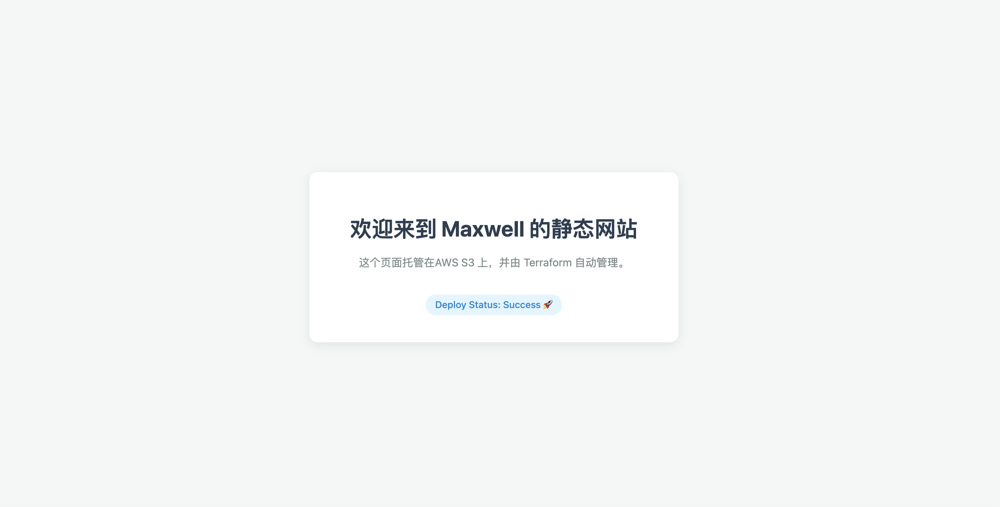

## Function

perform as aws s3 website HTTP support.

## Usage

### Requirements

| Name | Version |
|------|---------|
| terraform | >= 1.5.7 |
| aws | >= 6.28 |

### Providers

| Name | Version |
|------|---------|
| aws | >= 6.28 |


### Deploy

download this module in your lcoal directory and call this module like this:

```shell

module "maxwell_static_website" {
  source = "./modules/aws-s3-static-website"

  bucket_name = "prometheus-website-0521-maxwell"

  tags = {
    Environment = "dev"
    Terraform   = "true"
  }
}

```

the site looks like:



