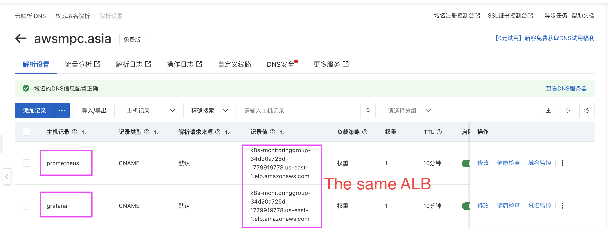

# Deploy Prometheus and Grafana

In this demo, I will use argocd to deploy prometheus and grafana on EKS 

- Use Argocd which installed on EKS to deploy Prometheus and Grafana using official helm charts

- A custom domain name is needed for me is awsmpc.asia

- Using "基于 Host 的七层 HTTP 路由复用" the grafana and promethes will using one ALB to save money


## Usage

- Prepare the applicaton.yaml for Argocd, here I name it argocd-prometheus.yaml

```shell
apiVersion: argoproj.io/v1alpha1
kind: Application
metadata:
  name: prometheus-stack
  namespace: argocd
spec:
  project: default
  source:
    # 官方 Prometheus Helm 仓库地址
    repoURL: 'https://prometheus-community.github.io/helm-charts'
    chart: kube-prometheus-stack
    targetRevision: 65.0.0
    helm:
      values: |
        grafana:
          enabled: true
        prometheus:
          prometheusSpec:
            scrapeInterval: 30s
  destination:
    server: 'https://kubernetes.default.svc' # 部署到本地 EKS 集群
    namespace: monitoring
  syncPolicy:
    automated:
      prune: true
      selfHeal: true
    syncOptions:
      - CreateNamespace=true    
      - ServerSideApply=true      
      - SkipDryRunOnMissingResource=true

```

- Install Official prometheus and grafana by Argocd

```shell
kubectl apply -f argocd-prometheus.yaml

```

- Check the prometheus related pods

```shell
kubectl get pods -n monitoring 
NAME                                                     READY   STATUS    RESTARTS   AGE
alertmanager-prometheus-stack-kube-prom-alertmanager-0   2/2     Running   0          117m
prometheus-prometheus-stack-kube-prom-prometheus-0       2/2     Running   0          117m
prometheus-stack-grafana-5c6bfc88f5-bqp6j                3/3     Running   0          91m
prometheus-stack-kube-prom-operator-d7d9fb9c5-mfplt      1/1     Running   0          117m
prometheus-stack-kube-state-metrics-678766cbdc-nb9ls     1/1     Running   0          117m
prometheus-stack-prometheus-node-exporter-bfj7r          1/1     Running   0          117m
prometheus-stack-prometheus-node-exporter-d2r6x          1/1     Running   0          117m
prometheus-stack-prometheus-node-exporter-dxw8p          1/1     Running   0          117m
prometheus-stack-prometheus-node-exporter-pl5vf          1/1     Running   0          117m
```

- Prepare the ingress file for Grafana, here i name it alb-ingress-grafana.yaml

```shell
apiVersion: networking.k8s.io/v1
kind: Ingress
metadata:
  name: monitoring-alb-ingress
  namespace: monitoring
  annotations:
    alb.ingress.kubernetes.io/scheme: internet-facing
    alb.ingress.kubernetes.io/target-type: ip
    # listener port 80
    alb.ingress.kubernetes.io/listen-ports: '[{"HTTP": 80}]'
    # using the HTTP if you do not have a TLS cert
    alb.ingress.kubernetes.io/backend-protocol: HTTP
    # health check
    alb.ingress.kubernetes.io/healthcheck-port: '3000'
    alb.ingress.kubernetes.io/healthcheck-path: /api/health
    alb.ingress.kubernetes.io/healthcheck-protocol: HTTP
    alb.ingress.kubernetes.io/success-codes: '200'
    alb.ingress.kubernetes.io/group.name: monitoring-group
spec:
  ingressClassName: alb
  rules:
    - host: grafana.awsmpc.asia  # your customer domain name
      http:
        paths:
          - path: /
            pathType: Prefix
            backend:
              service:
                name: prometheus-stack-grafana
                port:
                  number: 80

- Prepare the ingress file for prometheus, here i name it alb-ingress-prometheus.yaml

```shell
apiVersion: networking.k8s.io/v1
kind: Ingress
metadata:
  name: prometheus-alb-ingress
  namespace: monitoring
  annotations:
    alb.ingress.kubernetes.io/scheme: internet-facing
    alb.ingress.kubernetes.io/target-type: ip
    alb.ingress.kubernetes.io/listen-ports: '[{"HTTP": 80}]'
    alb.ingress.kubernetes.io/backend-protocol: HTTP
    alb.ingress.kubernetes.io/healthcheck-protocol: HTTP
    alb.ingress.kubernetes.io/healthcheck-port: traffic-port
    alb.ingress.kubernetes.io/healthcheck-path: /-/healthy
    alb.ingress.kubernetes.io/success-codes: '200'
    alb.ingress.kubernetes.io/group.name: monitoring-group
spec:
  ingressClassName: alb
  rules:
    - host: prometheus.awsmpc.asia # your customer domain name 
      http:
        paths:
          - path: /
            pathType: Prefix
            backend:
              service:
                name: prometheus-stack-kube-prom-prometheus
                port:
                  number: 9090

```
- From the two files, you can see there's not a standard alb-name declared and they share a same ingress group named "monitoring-group"

By using the same ingress group and custom host we set the two ingress using a same ALB

- Now you can create the two ingress

```shell
kubectl apply -f alb-ingress-grafana.yaml

kubectl apply -f alb-ingress-prometheus.yaml

```
- Check the ingress created

```shell
kubectl get ingress -n monitoring
NAME                     CLASS   HOSTS                    ADDRESS                                                                 PORTS   AGE
monitoring-alb-ingress   alb     grafana.awsmpc.asia      k8s-monitoringgroup-34d20a725d-1779919778.us-east-1.elb.amazonaws.com   80      44m
prometheus-alb-ingress   alb     prometheus.awsmpc.asia   k8s-monitoringgroup-34d20a725d-1779919778.us-east-1.elb.amazonaws.com   80      44m

```
- here you can see they use a SAME ALB

- Now go to Alicloud since my domain name awsmpc.asia is bought from Alicloud
  
  and create two CNAMEs for the two Hosts




